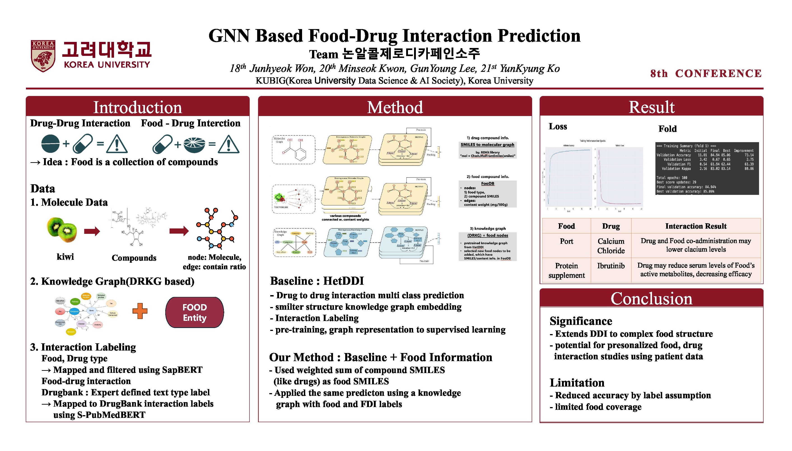

<div style="display: flex; justify-content: center; align-items: center; gap: 200px;">
  
  &nbsp;&nbsp;&nbsp;&nbsp;
  
</div>

# GNN-Based Food-Drug Interaction Prediction (KUBIG Conference 2025)

> [[Poster]](./assets/GNN_poster.pdf) [[Slides]](./assets/GNN_ppt.pdf)
> 
> by Junhyeok Won, [Minseok Kwon](https://github.com/minseok3180), [GeonYoung Lee](https://wltschmrz.github.io/), YunKyung Ko  
> [KUBIG (Korea University Data Science & AI Society)](https://www.kubigkorea.com/), [Korea University](https://www.korea.edu/sites/en/index.do)
> 
> This is the official repository for our KUBIG Conference 2025 project: [Graph-neural-network](https://github.com/minseok3180/Graph-neural-network).    
> Due to storage limitations, large data files are not included directly in this repository.  
> You can access the full dataset for inference here: [LINK](https://github.com/minseok3180/Graph-neural-network/tree/main/data/FOODRKG%2BDrugBank)  


**GNN-Based Food-Drug Interaction Prediction**.

We propose a framework that **extends drug-drug interaction (DDI)** models to predict **food-drug interactions (FDI)** by treating **food as a collection of compounds**, and integrating food information into a **knowledge graph (DRKG)**. Our method incorporates both **molecular graphs** and **heterogeneous knowledge graphs** to improve prediction quality.

---

## Overview



The pipeline consists of three major components:

- **Drug Compound Graph**  
  - Convert drug SMILES to molecular graphs using RDKit  
  - Node: atom, Edge: bond type

- **Food Compound Graph**  
  - From [FooDB](https://foodb.ca), extract food → compound relations  
  - Node: food or compound SMILES, Edge: content ratio (mg/100g)  

- **Knowledge Graph Extension**  
  - Extend DRKG by inserting **food nodes**  
  - Connect via shared compound SMILES

---

## Method

- **Baseline: HetDDI**  
  - Multi-class drug-drug interaction prediction  
  - Heterogeneous graph embeddings with pretraining  
  - Uses molecular graph + knowledge graph

- **Our Extension**  
  - Replace one drug input with **food** (as weighted compound SMILES)  
  - Insert food entity nodes into the knowledge graph  
  - Label food-drug interactions via NLP similarity (S-PubMedBERT) with DrugBank-style labels

---

## Setup

```bash
# Python 가상환경 구성 (conda 대신 venv)
python3.10 -m venv hetddi
source hetddi/bin/activate

# PyTorch 및 DGL 설치 (CUDA 11.7 버전)
pip install --upgrade pip
pip install torch==1.13.1+cu117 torchvision==0.14.1+cu117 torchaudio==0.13.1 --index-url https://download.pytorch.org/whl/cu117
pip install dgl==1.1.1 -f https://data.dgl.ai/wheels/cu117/repo.html

# 코드 다운로드 및 구성
pip install gdown
gdown --folder https://drive.google.com/drive/folders/1VKbVVzAcv_e3UgxId-Jrpac2SKqnCWeN
mv HetDDI/* . && rmdir HetDDI

# 라이브러리 경로 설정 (libcusparse 오류 해결용)
export LD_LIBRARY_PATH=/opt/conda/lib/python3.11/site-packages/nvidia/cusparse/lib:$LD_LIBRARY_PATH
echo 'export LD_LIBRARY_PATH=/opt/conda/lib/python3.11/site-packages/nvidia/cusparse/lib:$LD_LIBRARY_PATH' >> ~/.bashrc
source ~/.bashrc

# 기타 필수 라이브러리
pip install rdkit-pypi
conda install -c dglteam dgllife -y
pip uninstall numpy -y && pip install "numpy<2"
pip install easydict

# 실행
nohup python main.py > log/main.log 2>&1 &
````

---

## Inference - *(Inference support is not currently available.)*

You can perform prediction using a shell script.

### Step 1: Set Up `inference.sh`

Edit the following variables:

```bash
# inference.sh

FOOD="Port"
DRUG="Calcium Chloride"
```

### Step 2: Run

```bash
bash inference.sh
```

This will output:

* Interaction prediction label (e.g., “may decrease drug efficacy”)
* Retrieved similar examples with confidence score

---

## Results

### Training Curves

* Validation Accuracy converges > 84% across all folds
* FDI task shows more variance than DDI, due to label approximation

### Test Set Metrics

| Task | Loss | Accuracy | F1   | Precision | Recall | Kappa/AUC |
| ---- | ---- | -------- | ---- | --------- | ------ | --------- |
| FDI  | 0.66 | 83.7     | 60.9 | 57.7      | 70.4   | 81.7      |
| DDI  | 0.08 | 97.3     | 97.3 | 96.8      | 97.8   | -         |

### Example Predictions

| Food                     | Drug                    | Interaction Label                                                       |
| ------------------------ | ----------------------- | ----------------------------------------------------------------------- |
| Port (포트 와인)             | Calcium Chloride (염화칼슘) | Food may reduce calcium activity (칼슘 능도 저하)                             |
| Protein supplement (프로틴) | Ibrutinib (항암 표적 치료제)   | Food may reduce active metabolite levels, lowering efficacy (효과 저하 가능성) |

---

## Conclusion

### Contributions

* Extends drug interaction modeling to **complex food structures**
* Enables **personalized food-drug interaction prediction** with patient dietary data

### Limitations

* Accuracy reduction due to **label approximation**
* Limited to foods covered in **FooDB** compound information

---

## Acknowledgement

This work builds upon [HetDDI](https://github.com/LinsLab/HetDDI) and [DRKG](https://github.com/gnn4dr/DRKG). We thank the authors for their open-source contributions.

---

## License

This project is licensed under the Apache-2.0 License.  
Note that our method incorporates the DRKG knowledge graph, which includes data from multiple sources with potentially differing licenses.  
We retain the license attributes from the original DRKG repository on a per-node and per-edge basis.  
Users are responsible for verifying compliance with each source's license (see: [https://github.com/gnn4dr/DRKG#license](https://github.com/gnn4dr/DRKG/blob/master/licenses/Readme.md)).


---
